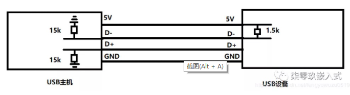
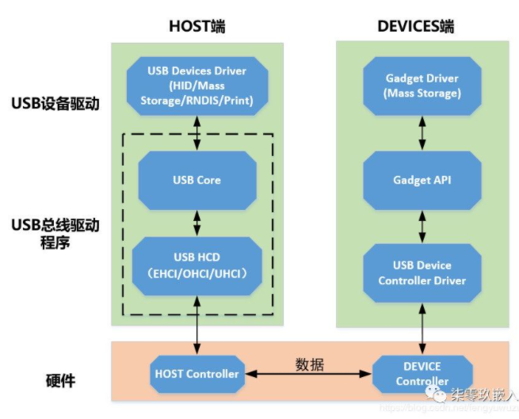
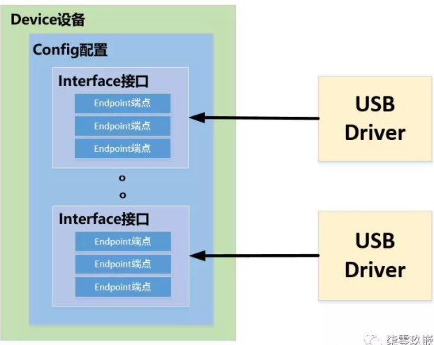

## USB子系统分析

[https://blog.csdn.net/fengyuwuzu0519/article/details/104259648](https://blog.csdn.net/fengyuwuzu0519/article/details/104259648)

### USB的基础知识

#### USB硬件结构

如图集线器USB Root Hub的俩数据线D+ D-都接了15k的下拉电阻，当无设备接入的时候，都为低电平。如果设备接入，由于设备的数据线上有1.5K的上拉电阻，使得1根数据线被拉高。集线器根据数据线被拉高得知有设备接入，并根据D+为高还是D-为高来判断所接入的设备是全速USB设备(D+为高)，还是低速USB设备(D-为高)

#### USB的识别过程

- 当识别有USB设备插入后，linux的USB总线驱动程序发出命令至该设备，与设备对话，并询问设备信息(描述符)，设备收到请求后，回复设备描述符给总线驱动程序。总线驱动程序会为设备分配一个地址，当后期访问某个USB设备的时候，均会使用这个地址编号。当新接入的设备第一次被访问时，以地址0来访问。当USB总线驱动程序识别出设备后，会为其找到该设备的驱动程序，比如键盘，鼠标，U盘。

USB通讯过程均为主从结构，USB主机发起通信请求，设备进行数据回复，USB设备不具备主动向主机通信的能力。

### USB总线驱动架构

#### USB的总线驱动框架

#### USB Core

USB Core这个模块是纯软件，是所有USB设备赖以生存的核心，代码位于kernel/drivers/usb/core。

USB Core为设备驱动程序提供服务，提供一个用于访问和控制USB硬件的接口， 而不用考虑系统当前使用的是哪种Host Controller。USB Core将用户的请求映射到相关的HCD，用户不能直接访问HCD。USB Core就是HCD和USB设备的桥梁。

USB的初始化函数是在usb/core/usb.c中定义，主要是完成bus_register(USB总线注册)，usb_major_init(注册usb主控制器字符设备)，usb_register(注册usbfs驱动)，usb_hub_init(USB Hub初始化，注册hub驱动，创建内核守护线程来监测hub端口的状态变化)

#### USB HCD

硬件主机控制器Host Controller之上运行的是HCD，是对主机控制器硬件的一个抽象，实现核心层和控制器之间的对话接口，USB HCD包含了多种USB接口规范。

- UHCI intel提供，通用主机控制接口，USB 1.0 1.1

- OHCI 微软提供，开放主机控制接口， USB 1.0/1.1

- EHCI 增加主机控制接口 USB 2.0

#### USB Device Driver

USB设备是由一些配置Cofiguration，接口Interface和端点Endpoint组成，即一个USB设备可以包含有一个或者多个配置，在每个配置中包含了一个或者多个接口，在每个接口中可包含若干个端点。一个USB设备驱动可能包含多个子驱动，一个USB设备子驱动程序对应一个USB接口，而非整个USB设备。

USB设备使用各种描述符来说明设备架构，包含设备描述符，和配置描述符，接口描述符，端点描述符，字符描述符。

USB传输的对象是端点，每个端点都有传输类型，传输方向，除了端点0外，每个端口只支持一个方向的数据的传输，端点0用于控制传输，既能输出也能输入。

#### USB的传输类型

* 控制传输： 可靠 时间有保证， 比如USB设备的识别过程

* 批量传输:   可靠 时间没有保证 比如U盘

* 中断传输:    可靠 实时 比如: USB鼠标

* 实时传输： 不可靠 实时 比如 USB摄像头

