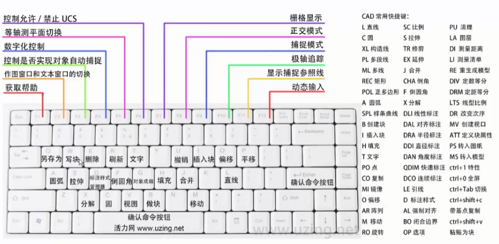
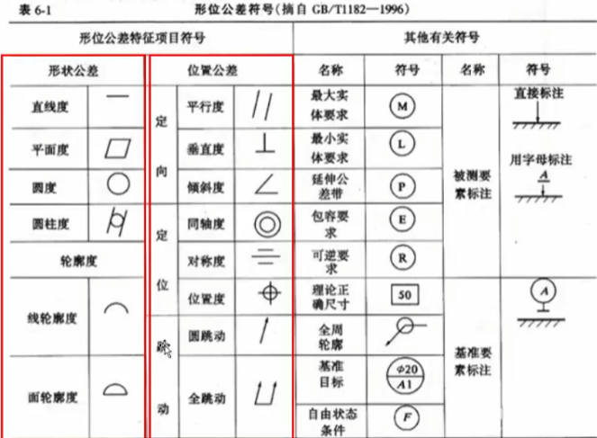
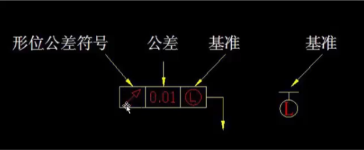
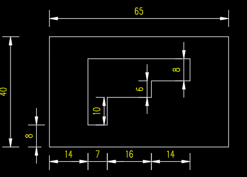
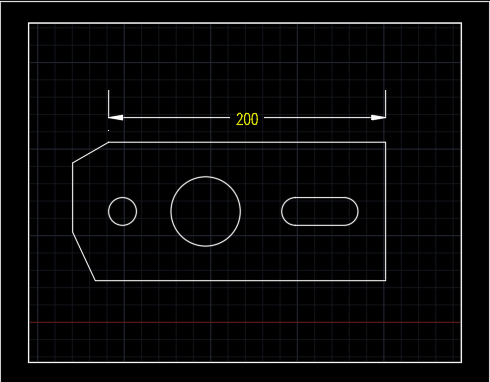

## AutoCAD 2016 入门

### 软件介绍

[https://www.uzing.net/course_show-171-5363-12-5-0.html](https://www.uzing.net/course_show-171-5363-12-5-0.html)

#### 操作步骤

##### 快捷键列表

##### 操作过程

* 输入命令  `如上快捷键表`
* 确认命令 `空格-回车-右键菜单`
* 留意命令行，`根据命令行提示输入，如直线的输入坐标20,20 @100<30 @30,30`
* 撤销命令 `U`
* 结束命令 `空格-回车-右键菜单`
* 取消命令 `ESC`

#### 物体选择方式

用鼠标左键直接去点击物体，就是选中。加选就继续点其他物体，减选是按住shift键点到要减选的物体上。

点击鼠标左键，然后移动鼠标。__向右是框选，蓝色，只有区域完成包裹才选中；向左是交叉选，绿色，又叫碰选，只要碰到就选中__。

#### 视图操作

* 平移：`按住鼠标中键`

* 缩放：`滚动鼠标中键`

* 充满视图：`双击鼠标中健`

### 初始设置

#### 重置CAD配置

> 工具/选项/配置/重置

#### 初始化设置

* 选项op

  * 文件

    * 自动保存位置

  * 显示

    * 颜色设置

        >二维模型空间/布局/块编辑器 统一背景黑色 十字光标白色

    * 布局元素

        > 只勾选  显示布局和模型选项卡  
        十字光标大小设置  80-100  
        显示精度 1000

  * 打开和保存

    >另存为 Autocad 2004 dwg为了更好的兼容  
    标题中显示文件完整路径  
    自动保存时间为10分钟

  * 打印和发布

    >打印输出设备 DWG to PDF.pc3  
    保存位置根据自己喜好来设置

  * 系统

    >关闭 帮助/访问联机内容

  * 用户系统配置

    >插入比例设置为毫米

  - 绘图

    > 自动捕捉标记大小 50%  
    靶框大小 50%  
    对象捕捉选项 `只勾选动态UCS忽略 z轴负向的对象捕捉`

  - 三维建模

    > 在视图中显示工具，如果真是做二维模型图，可以不勾选该区域内的所有项

  - 选择集

    > 拾取框大小  30-50%  
    夹点尺寸 30-50%

  - 图形单位 un

  - 栅格 F7

  - 草图 ds  (DSSETINGS)

    - 启动捕捉和启动栅格 关闭
    - 启用极轴跟踪 打开
    - 对象捕捉 全选
    - 三维对象捕捉 关闭
    - 动态输入 启用指针输入这个很方便，关键
    - CTL+SHIFT+P 显示特性选项板

#### 新建和保存默认样板

>上一步我们设置了初始化设置后，可以保存为样板文件，在选项/文件/样板设置/快速新建样板文件 选择我们刚设置的样板文件，以后我们每次新建文件就可以以这个为样板。

#### 工作空间

- 可以根据自己的喜欢，定制工具栏，并保存为工作空间。
操作步骤：
1. 先右键菜单把默认的工具栏关闭掉
2. 通过工具栏添加autocad常用工具栏  修改，图层，图层2，工作空间，标准，标注，特性，绘图。自己调整位置后，保存为autocad工作空间。
3. 可以在草图和注释/autocad工作空间之间自由切换

### 工具命令

- #### 直线 构造线 多段线
    > 直线 L  
    > 构造线 XL  
    > 多段线 PL

- #### 多边形，矩形，圆弧
    > 多边形 POL  
    > 矩形 REC  
    > 圆弧 A

- #### 圆 修订云线 样条曲线
    > 圆 C  
    > 修订云线 REVCLOUD  
    > 样条线 SPL

- #### 椭圆 椭圆弧 插入块 创建块命令
    > 椭圆 EL  
    > 椭圆弧 椭圆的一部分 EL  
    > 创建块 B  块的概念是把一些图形保存为整块，方便插入  
    > 插入块 I

- #### 点 图案填充 渐变色 面域命令
    > 点 PO  
    > 点样式管理 DDPTYPE  
    > 图案填充 H ，工作空间草图与注释下面HE是打开图案填充面板。  
    > 填充图案如果比率不对，会一直是白色  
    > 渐变色命令 GD  
    > 面域  REG  `面域的功能是可以把不是闭合的物体，合并成一个闭合物体。`

- #### 表格 文本 根据选择对象绘制命令
    > 表格 TB  插入方式为指定窗口  
    > 文本 T  
    > 根据对象选择绘制 ADD  使用A到的命令后，选择一个对象，然后就可以再画一个这个对象

- #### 多线 射线 撤销命令
    > 多线 ML  
    > 射线 RAY  
    > 撤销 CTRL+Z=U+空格  
    > 重复上一次命令 空格

- #### 各种圆的画法
    > 通过寻找切点TAN来画圆

- #### 等分命令的运用
    > 等距等分 ME  
    > 定数等分 DIV   
    > 块等分  DIV-B 块名字

- #### 特殊文字和符号的输入
    > 文本里面，特殊字符

- #### 删除 复制 镜像 偏移
    > 删除E  
    > 复制 CO  
    > 镜像 MI  
    > 偏移 O

- #### 阵列 定制快捷键
    > 阵列 Ar
    > 阵列经典 ARRAYCLASSIC
    > 定制快捷键  工具/自定义/编辑程序参数AR, *ARRAY

- #### 移动 旋转 缩放 拉伸
    > 移动 M   
    > 旋转 RO   
    > 缩放 SC   
    > 拉伸 S  

- #### 修剪 延伸 打断
    > 修剪 TR  
    > 延伸 EX  
    > 打断 BR

- #### 合并 倒角 圆角 光滑曲线 分解
    > 合并 J **相似类型的物体才能合并**   
    > 倒角 CHA  
    > 圆角 F  半径为0画直角 
    > 光滑曲线 BLE

- #### 分解 填充修改
    > 分解 X  
    > 填充修改 HE

- #### 标注样式 命令D
> - 线 Bylayer  
> - 符号和箭头 实心闭合
> - 文字 
> - 调整  
    > 文字始终保持在尺寸界线之间  
    > 文字位置 尺寸线上方，不带引线  

>  - 主单位

 * #### 线性标注 对齐标注 弧长标注 坐标标注

    > 线性标注 DLJ  
    > 对齐标注 DAL  
    > 弧长标注 DAR  
    > 坐标标注 DIMORD  
    > UCS设置原点  

- #### 半径标注 折弯标注 直径标注 角度标注

    > 半径标注 DRA  
    > 折弯标注 JOG  
    > 直径标注 DDI  
    > 角度标注 DAN  

- #### 快速标注 基线标注 连续标注 等距标注

    > 快速标注 QDIM  
    > 基线标注 DBA  
    > 连续标注 DCO  
    > 等距标注 DIMSPACE  

- #### 折断标注 公差 圆心标记 折弯标记

    > 折断标注 DIMBREAK  
    > 圆心标记 DCE  
    > 校验标注 DEMINSPECT  
    > 折弯标注 JOG  

- #### 公差 TOL

> 

> 

> %%c 直径  堆叠一上一下

  * 形状公差

- 位置公差

  - 定向公差

  - 定位公差

- #### 编辑标注 编辑标注文字 标注更新
    > 编辑标注  DED  
    > 编辑标注文字 DIMTEDIT  
    > 标注更新 APPLY  
    > 标注样式 D  

- #### 标准工具命令
    > 特性匹配  MA  
    > 工具选项面板 CTRL+3 

- #### F1到F12命令详情
    > F1 获取帮助  
    > F2 实现作图窗口和文本窗口的切换  
    > F3 **控制是否实现对象自动捕捉**   
    > F4 数字化仪控制  
    > F5 等轴测平面切换  
    > F6 控制状态行上坐标的显示方式  
    > F7 **栅格显示模式控制**   
    > F8 **正交模式控制**  
    > F9 栅格捕捉模式控制  
    > F10 **极轴模式控制**  
    > F11 **对象追踪模式控制**    可以帮助画直角，切线等  
    > F12 **动态输入**   

- #### 强制对齐 创建闭合边界 选项 清理
    > 强制对齐 AL  
    > 创建闭合边界  
    > 选项 OP  
    > 清理  

- #### 图层 测量距离 测量清单 重生成模型
    > 图层  LA 
    > 测量距离 DI  
    > 测量清单 LI  
    > 重生成模型 RE 

- #### 图形修复管理器 线型比率 改变显示次序 带基点复制和黏贴
    > 图形修复管理器 DRM  
    > 线型比例 LTS  
    > 改变显示次序 DR  
    > 带基点复制/粘贴   CTRL+SHIFT+C/ CTRL+SHIFT+V  

- #### 文件切换 显示隐藏命令栏 特性 全屏
    > 文件切换 CTRL+TAB  
    > 显示隐藏命令栏 CTRL+9  
    > 特性  CTRL+1  
    > 全屏 CTRL+0  

### 案例操作

- 特殊图形的绘制I
    > 使用画图技巧  
    使用偏移命令画辅助线  
    ERASE擦除辅助线  
    连续标注DCO

    > 

- 特殊图形的绘制ii

- 案例上

- 案例中

- 案例下

### 图层运用

- 图层特性管理器 
    > 图形特性管理器 LAS   设置各个图层的显示，统一管理  
    > 图层  LA  ** ** **设置为bylayer后，才能跟随图层变化**   
    > 线宽  LWDISPLAY

- 图层特性匹配  
    > 特性匹配 MA  
    > 清理 PU  **没有使用的图层和样式等会被清理掉**  
    > 0图层的重要性 **在做块之前要把选择对象设置为0图层**  
    > 安装图例和文字 直接copy文字和图案

- 模型和布局空间
    > MV 开视口  操作步骤 画矩形-MV-点对角线-双击-移动放大-PS退出
    > 布局空间创建的图层管理器，需要拿到模型空间来恢复和保存
    > 
    > MS进入视口 双击也是进入视口
    > PS退出视口
    > 圆形视口 C-MV-O

### 打印设置

- 打印设置

- 批量打印

### 尾篇

需要补充知识
注释的美观

